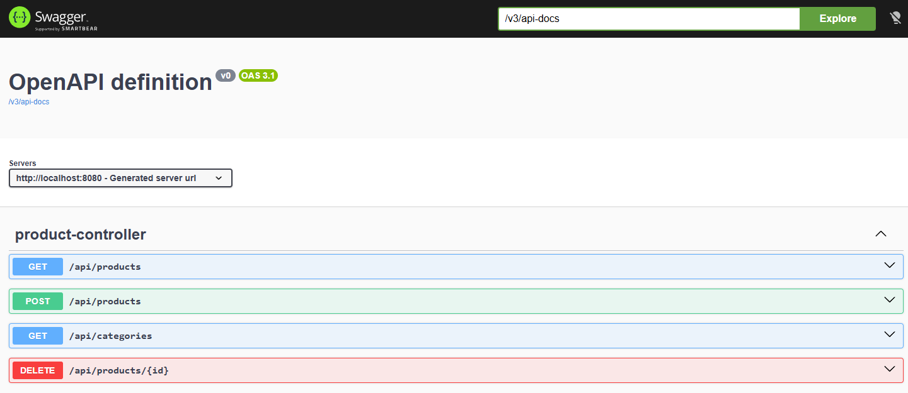

# Spring Boot REST API Demo (Products)

A portfolio backend project demonstrating solid Spring Boot
fundamentals, clean API design, pagination, validation, and JWT-based
authentication.

This project showcases practical backend engineering skills with a focus
on clean architecture, security, maintainability, and production-oriented practices.

------------------------------------------------------------------------

## 🔧 Tech Stack

-   Java 17
-   Spring Boot 3
-   Spring Data JPA
-   H2 (in-memory database)
-   Spring Security (JWT, stateless)
-   OpenAPI / Swagger
-   Actuator (health endpoint)
-   Maven (wrapper included)
-   Docker (optional local execution)
-   GitHub Actions (CI pipeline)

------------------------------------------------------------------------

## 🏗 Architecture

Layered design:

Controller → Service → Repository

Key features:

-   DTO validation (`@Valid`)
-   Global exception handling (`@RestControllerAdvice`)
-   Pagination & sorting with `Pageable`
-   Stateless JWT authentication
-   Role-based authorization
-   Consistent API response wrapper

------------------------------------------------------------------------

## 🔐 Authentication (JWT)

The project includes JWT-based authentication using in-memory users for
easy local evaluation.

### Demo Credentials

ADMIN  
username: admin  
password: admin123

USER  
username: user  
password: user123

### Login Endpoint

POST /api/auth/login

Example body:

{ "username": "admin", "password": "admin123" }

The response returns a Bearer token.

Use the token in protected endpoints:

Authorization: Bearer <token>

------------------------------------------------------------------------

## 📦 API Endpoints

### Public Endpoints

-   GET /api/products
-   GET /api/categories
-   POST /api/auth/login
-   /swagger-ui/index.html
-   /actuator/health

### Protected (ADMIN Required)

-   POST /api/products
-   DELETE /api/products/{id}

------------------------------------------------------------------------

## 📄 Pagination Example

GET /api/products?page=0&size=5&sort=price,desc

------------------------------------------------------------------------

## ▶ Quick Start (Local)

### Requirements

-   Java 17
-   Maven 3.9+ (or use included Maven Wrapper)

Run:

Using Maven:
mvn clean spring-boot:run

Using Maven Wrapper (recommended):
./mvnw clean spring-boot:run

App runs at:

http://localhost:8080

------------------------------------------------------------------------

## 🐳 Quick Start (Docker - Optional)

Build and run:

docker compose up --build

Stop:

docker compose down

Note: Docker support is included for portability and learning purposes.
The primary development workflow is local Maven execution.

------------------------------------------------------------------------

## 📊 API Documentation

Swagger UI:
/swagger-ui/index.html

OpenAPI JSON:
/v3/api-docs

Health check:
/actuator/health

------------------------------------------------------------------------

## 🧪 Testing

Basic integration tests are included using Spring Boot Test and MockMvc.

The test suite validates:

-   JWT authentication flow
-   Role-based authorization
-   Protected endpoint behavior
-   Validation error handling

### Running tests

Using Maven:
mvn test

Using Maven Wrapper:
./mvnw clean verify

All tests are automatically executed in the GitHub Actions CI pipeline on every push.

Included test classes:

-   AuthControllerIT — verifies login and JWT generation
-   ProductSecurityIT — verifies protected endpoints and role-based
    access

These tests ensure authentication, authorization, and validation behave
as expected.

------------------------------------------------------------------------

## 📸 Screenshots

### Swagger UI

### Health Check (Actuator)

### OpenAPI JSON

------------------------------------------------------------------------

## 🧠 Design Notes

-   Stateless authentication using JWT
-   BCrypt password encoding
-   Roles stored as JWT claims
-   Custom JWT filter extending OncePerRequestFilter
-   Clean separation of responsibilities
-   Validation errors returned in consistent JSON format

------------------------------------------------------------------------

## 🎯 Purpose

This project is part of my backend portfolio to demonstrate practical
Spring Boot development skills, structured API design, security
fundamentals, automated testing, and clean architecture principles.
