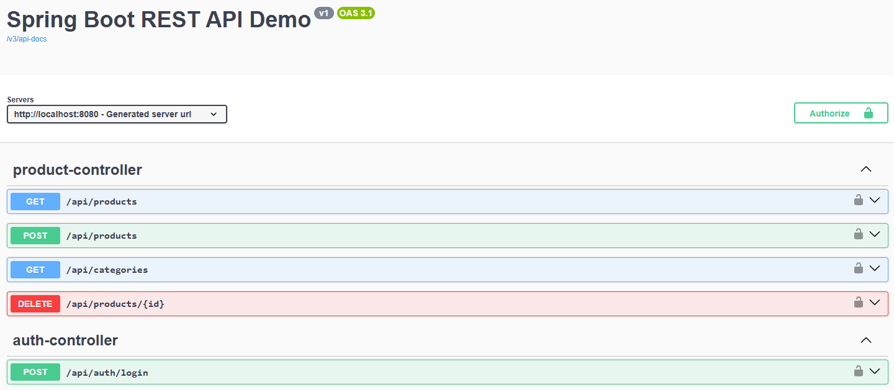
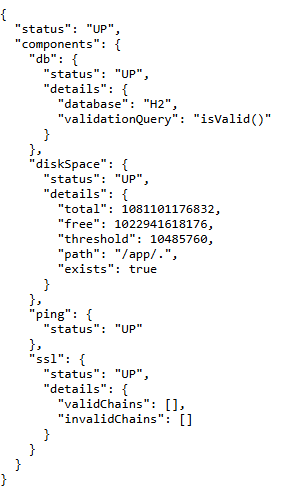
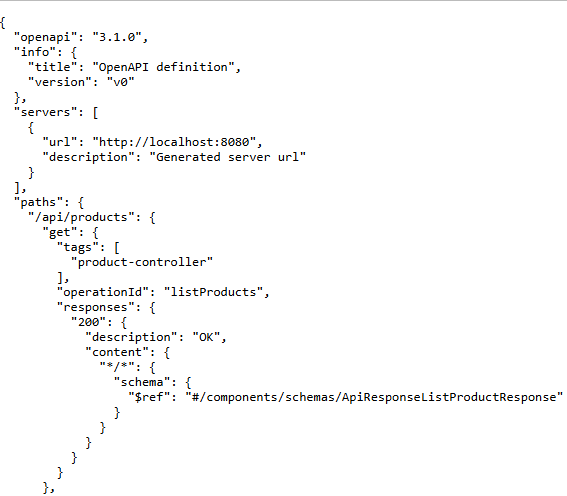

# Spring Boot REST API Demo (Products)

A portfolio backend project demonstrating solid Spring Boot
fundamentals, clean API design, pagination, validation, JWT-based
authentication, automated testing, CI integration, and cloud deployment.

This project showcases practical backend engineering skills with a focus
on clean architecture, security, maintainability, and
production-oriented practices.

------------------------------------------------------------------------

## 🎯 Purpose

This project is part of my backend portfolio to demonstrate practical
Spring Boot development skills, structured API design, security
fundamentals, automated testing, CI/CD integration, and clean
architecture principles.

------------------------------------------------------------------------

## 🔧 Tech Stack

-   Java 17
-   Spring Boot 3
-   Spring Data JPA
-   H2 (in-memory database)
-   Spring Security (JWT, stateless)
-   OpenAPI / Swagger
-   Actuator (health endpoint)
-   Maven (wrapper included)
-   Docker (multi-stage build)
-   GitHub Actions (CI pipeline)
-   Render (cloud deployment)

------------------------------------------------------------------------

## 🌍 Live Demo (Cloud Deployment)

Home:
https://springboot-rest-api-demo.onrender.com

Swagger UI:
https://springboot-rest-api-demo.onrender.com/swagger-ui/index.html

Health Check:
https://springboot-rest-api-demo.onrender.com/actuator/health

Note: Free instances spin down after inactivity, so the first request
may take a few seconds to respond.

------------------------------------------------------------------------

## 🏗 Architecture

Layered design:

Controller → Service → Repository

Key features:

-   DTO validation (`@Valid`)
-   Global exception handling (`@RestControllerAdvice`)
-   Pagination & sorting with `Pageable`
-   Stateless JWT authentication
-   Role-based authorization
-   Consistent API response wrapper

------------------------------------------------------------------------

## 🔐 Authentication & Protected Endpoints (JWT)

The API uses stateless JWT authentication with in-memory demo users for
evaluation purposes.

### Demo Credentials

ADMIN\
username: admin\
password: admin123

USER\
username: user\
password: user123

### How to Test

**1️⃣ Login**

POST `/api/auth/login`

Example:

{ "username": "admin", "password": "admin123" }

The response returns a JWT token.

**2️⃣ Use the token**

Include in header:

Authorization: Bearer `<your_token>`{=html}

**3️⃣ Access protected endpoints (ADMIN only)**

-   POST `/api/products`
-   DELETE `/api/products/{id}`

Example body:

{ "sku": "SKU-1001", "name": "Demo Product", "price": 100, "categoryId":
1, "active": true }

Note: The demo uses an in-memory H2 database. Data resets when the
application restarts.

------------------------------------------------------------------------

## 📦 Public Endpoints

-   GET `/api/products`
-   GET `/api/categories`
-   POST `/api/auth/login`
-   `/swagger-ui/index.html`
-   `/actuator/health`

------------------------------------------------------------------------

## 📄 Pagination Example

GET `/api/products?page=0&size=5&sort=price,desc`

------------------------------------------------------------------------

## ▶ Quick Start (Local)

Requirements:

-   Java 17
-   Maven 3.9+ (or use included Maven Wrapper)

Run:

mvn clean spring-boot:run

or

./mvnw clean spring-boot:run

App runs at:

http://localhost:8080

------------------------------------------------------------------------

## 🐳 Quick Start (Docker)

docker compose up --build

Stop:

docker compose down

------------------------------------------------------------------------

## 📊 API Documentation

Swagger UI: /swagger-ui/index.html

OpenAPI JSON: /v3/api-docs

Health check: /actuator/health

------------------------------------------------------------------------

## 🧪 Testing

Integration tests are included using Spring Boot Test and MockMvc.

Validated areas:

-   JWT authentication flow
-   Role-based authorization
-   Protected endpoint behavior
-   Validation error handling

Run tests:

mvn test

or

./mvnw clean verify

Tests execute automatically via GitHub Actions on every push.

------------------------------------------------------------------------

## 🚀 Deployment Overview

The project is containerized using a multi-stage Docker build:

-   Maven build stage
-   Lightweight JRE runtime stage
-   Environment-based port configuration (`server.port=${PORT:8080}`)
-   HTTPS termination handled by Render
-   Health monitoring via Actuator
-   CI ensures successful builds before deployment

In production, H2 would be replaced by a persistent database
(PostgreSQL/MySQL) with externalized configuration.

------------------------------------------------------------------------

## 📸 Screenshots

### Swagger UI

### Health Check (Actuator)

### OpenAPI JSON

------------------------------------------------------------------------

## 🧠 Design Notes

-   Stateless authentication using JWT
-   BCrypt password encoding
-   Roles stored as JWT claims
-   Custom JWT filter extending OncePerRequestFilter
-   Clean separation of responsibilities
-   Consistent validation error responses
